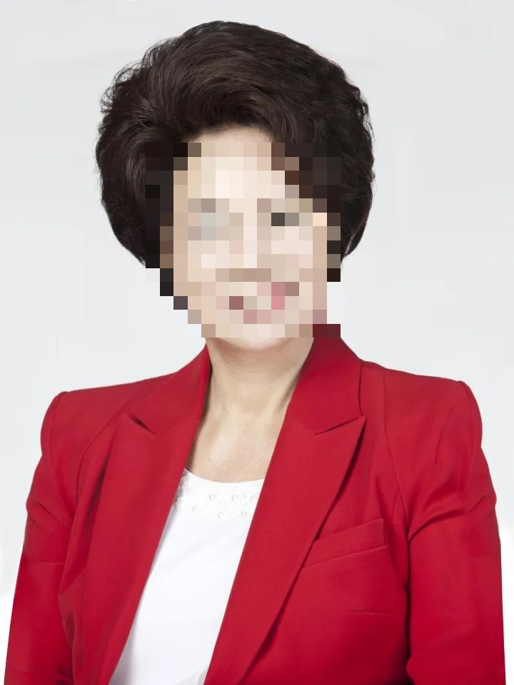

## 1. 실행 결과 (Demo)

## 2. 실행방법 : 사진 파일을 넣고 실행하면 모자이크 처리된 final result가 나옵니다.

*위와 같이 입력된 사진에서 자동으로 얼굴을 찾아 모자이크 처리합니다.*

## 3. 참고 자료 (References)
- OpenCV 라이브러리 공식 문서
- Python Haar Cascade 예제
- Google gemini

## 4. 팀원 구성
- 202534121 최예성 (조장)
- 202534020 박지용
- 202534028 백승민
